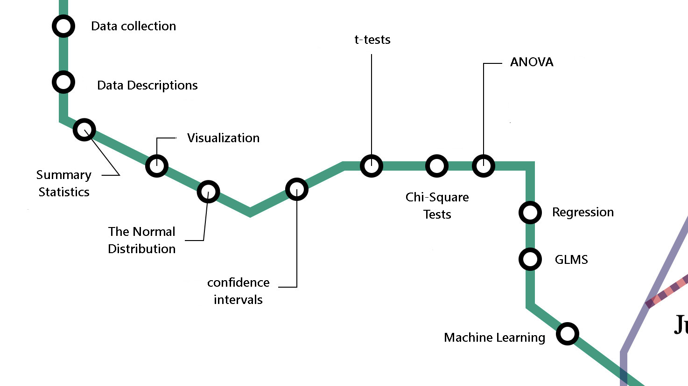
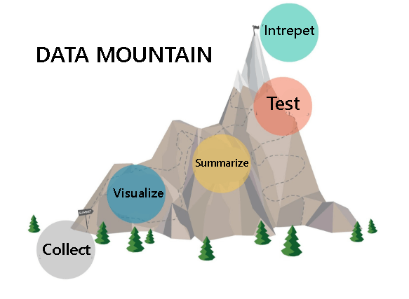
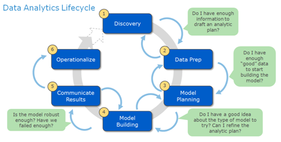
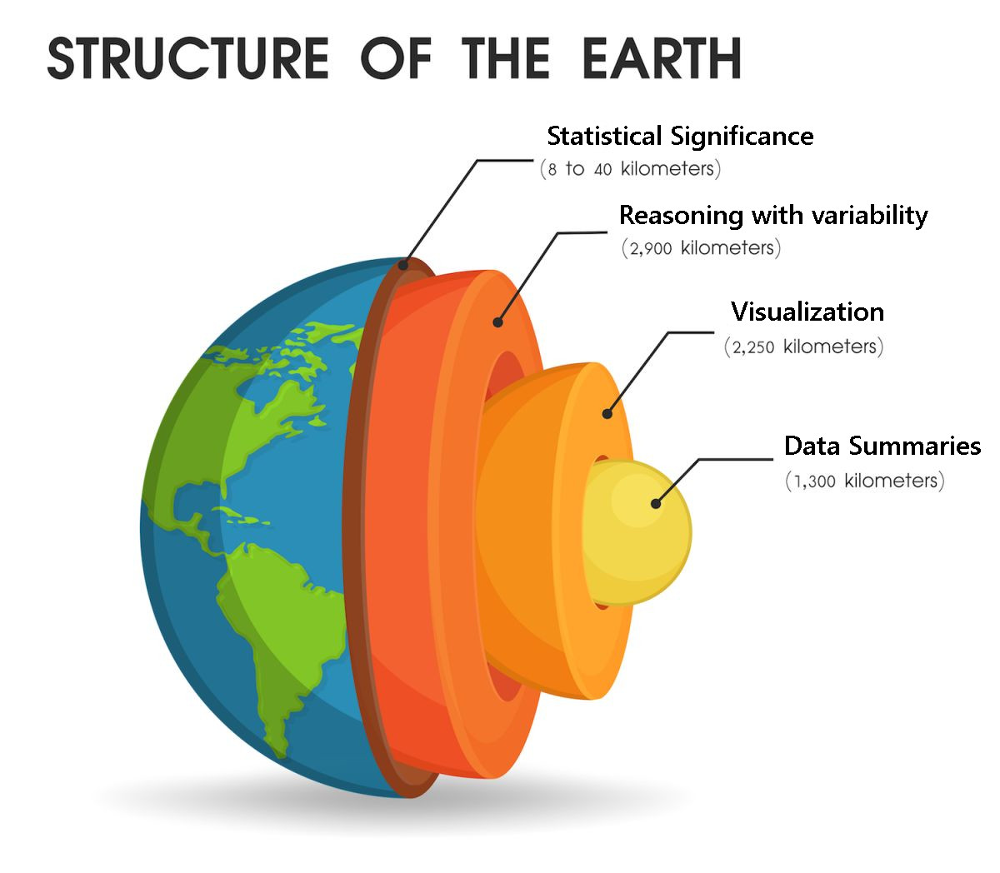
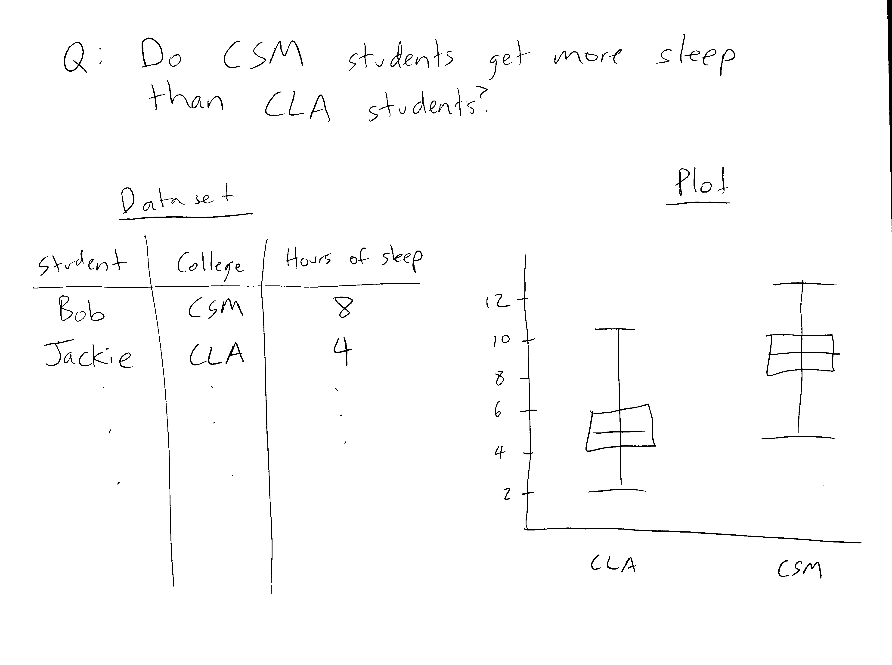

```{r setup, include=FALSE}
options(htmltools.dir.version = FALSE)

library(flair)
#library(icon)
#library(emo)
library(tidyverse)
library(knitr)
library(kableExtra)
```

```{r xaringan-themer, include = FALSE}
library(xaringanthemer)
mono_light(
  base_color = "#26116c",
  text_bold_color = "#fd5e53",
  title_slide_text_color = "#fff8e7",
  background_color = "#fff8e7",
  header_font_google = google_font("Roboto"),
  text_font_google   = google_font("Roboto Condensed"),
  code_font_google   = google_font("Droid Mono")
)
```

```{css, echo = FALSE}
img {
  height: 400px;
}

.remark-code {
  font-size: 30px;
}

.remark-slide {
  background-size: cover;
}
```
---
class: center, middle

# A quick grading exercise

---

# The Question:

In 1952, a group of scientists decided to study the effect of Vitamin C supplements
on tooth growth.  They gathered a set of 60 guinea pigs, and gave half the animals
pure vitamin C and half the animals Orange Juice.  They then measured the length
of the guinea pigs' incisor teeth.

The results of the study are summarized below:

```{r, echo = FALSE}
my_tabs <- ToothGrowth %>%
  group_by(supp) %>%
  summarize(`Mean Tooth Length` = mean(len), 
            `SD of Tooth Length` = sd(len),
            `Sample Size` = n()) %>%
  rename(`Supplement Type` = supp) %>%
  mutate(
    `Supplement Type` = factor(`Supplement Type`, 
                               levels = c("OJ", "VC"), 
                               labels = c("Orange Juice", "Vitamin C")),
  ) 

my_tabs %>%
  kable(booktabs = TRUE)  %>%
  kable_styling(position = "center")
```

Is there evidence at the 0.05 level that the orange juice is more beneficial to tooth
growth than Vitamin C supplements?

---
# The Correct Answer

```{r, include = FALSE}
t.test(len ~ supp, ToothGrowth, alternative = "greater")
```

<p style="border:3px; border-style:solid; border-color:#6495ed; padding: 1em;">
With a t-score of <b>1.91</b>, we get a p-value of <b>0.03</b>.
<br>
There <b>is evidence</b> that Orange Juice leads to more tooth
growth than Vitamin C.
</p>

---
# Student Responses

<p style="border:3px; border-style:solid; border-color:#6495ed; padding: 1em;">
With a t-score of <b>1.91</b>, we get a p-value of <b>0.03</b>.
<br>
There <b>is evidence</b> that Orange Juice leads to more tooth
growth than Vitamin C.
</p>


**Student A:**

<p style="border:3px; border-style:solid; padding: 1em;">
With a t-score of <b>1.91</b>, we get a p-value of <b>0.03</b>.  
<br>
There <font color = "red"><b> is not evidence</b></font> that Orange 
Juice leads to more tooth
growth than Vitamin C.
</p>


---
# Student Responses

<p style="border:3px; border-style:solid; border-color:#6495ed; padding: 1em;">
With a t-score of <b>1.91</b>, we get a p-value of <b>0.03</b>.
<br>
There <b>is evidence</b> that Orange Juice leads to more tooth
growth than Vitamin C.
</p>

**Student B:**

<p style="border:3px; border-style:solid; padding: 1em;">
With a t-score of <font color = "red"><b>-1.91</b></font>, we get a p-value of <b>0.03</b>.  
<br>
There <b>is evidence</b> that <font color = "red">Vitamin C</font> leads to more tooth growth than <font color = "red">Orange Juice</font>.
</p>

---
# Student Responses

<p style="border:3px; border-style:solid; border-color:#6495ed; padding: 1em;">
With a t-score of <b>1.91</b>, we get a p-value of <b>0.03</b>.
<br>
There <b>is evidence</b> that Orange Juice leads to more tooth
growth than Vitamin C.
</p>

**Student C:**


<p style="border:3px; border-style:solid; padding: 1em;">
<font color = "red">The standard deviation of the mean for the OJ group is 1.2.
The mean of the OJ group is about 4mm above the mean of the VC group.  This
difference is a lot bigger than the standard deviation. </font>
<br>
Thus, I think there <b>is evidence</b> that Orange Juice leads to more tooth
growth than Vitamin C.
</p>


---
class: center, middle

# How did you score these students?

---

# Who got what wrong?

**Student A** got
* the **correct** t-score
* the **correct** p-value
* the **wrong** conclusion

**Student B** got
* the **correct** (ish) t-score
* the **correct** p-value
* the **wrong** conclusion

**Student C** got
* **no** t-score
* **no** p-value
* the **correct** conclusion


---
class: center, middle

# Which student would you want to hire?

---

```{r, echo = FALSE}
my_tabs %>%
  kable(booktabs = TRUE)  %>%
  kable_styling(position = "center")
```


**Student A:**


<p style="border:3px; border-style:solid; padding: 1em;">
There <b> is not evidence</b> that Orange 
Juice leads to more tooth growth than Vitamin C.
</p>

**Student B:**

<p style="border:3px; border-style:solid; padding: 1em;">
There <b>is evidence</b>  that Vitamin C leads to more tooth growth than Orange Juice.
</p>

**Student C:**

<p style="border:3px; border-style:solid; padding: 1em;">
I think there <b>is evidence</b> that Orange Juice leads to more tooth
growth than Vitamin C.
</p>

--

I argue that **Student C** deserves the highest grade.

---
class: center, middle, inverse

# Being able to draw 
# **reasonable conclusions**
# from data is 
# **way more important**
# than being able to 
# perform a hypothesis test.

---
class: middle
> Many students leave their introductory course thinking of statistics only as a 
**disconnected collection** of methods and tools. 


> - Guidelines for Assessment and Instruction in Statistics Education (GAISE), 2016

---
# The Train Model
.center[

]


---
# The Mountain Model
.center[

]
---
class: middle

> We recommend that throughout the entire introductory course, instructors illustrate
the **complete investigative cycle** with every example/exercise presented, starting with the
**motivating question** that led to the data collection and ending with the **scope of conclusions** and
directions for future work.  

> (GAISE 2016)

---
# The Cycle Model

.center[

]

(Dietrich, 2013)

---
class: middle

> It can be challenging to present material in a way that facilitates students’ development
of more than just a **surface level understanding of important concepts and ideas**. 

> (GAISE 2016)

---
# An "Inside-Out" Statistics Class
.center[

]


---
class: center, middle

# But how?

---
class: center, middle, inverse
# Technique 1:
# "Imaginary Results"


---

# Imaginary Results

**Before** you examine any data, ask students to imagine what they **might**
observe.

--

<p style="border:3px; border-style:solid; border-color:#6495ed; padding: 1em;">
<b> ACTIVITY </b> 
<br>
<ul>
<li> Choose a research question from the supplied list. </li>
<li> Imagine a dataset that might address this research question.  Write down your
dataset, inventing possible numbers for the first few rows. </li>
<li> Sketch a visualization that summarizes the data in your imaginary dataset.
What might it look like, and what would you conclude? </li>
</p>

---
# Example
.center[

]

---
# "Imaginary Results"

* Trains students to **think** before they **assess**.

--

* Helps prevent **mismatch** between the *research question* and the *dataset*

--

* Fosters *good instincts*.

---
class: inverse, center, middle
# Technique 2: 
# "Expectations vs. Reality"

---
# Expectations vs. Reality

Ask students to write down:

--

* What did you **expect to see** if the answer to the research question is "no"?

--

* What did you **expect to see** if the answer to the research question is "yes"?

--

* What did you **actually** see?


---
# Expectations vs Reality

<p style="border:3px; border-style:solid; border-color:#6495ed; padding: 1em;">
<b> Research Question: </b> Do CSM students get more sleep than CLA students?
<br><br>
<b> Expect if yes: </b> The average hours of sleep among CSM students in this class
will be a bigger number than the average hours among CLA students.
<br><br>
<b> Expect if no: </b>  The average hours of sleep will be about the same.
<br><br>
<b> Actually saw: </b>  In this class 15 CLA students averaged 7.1 hours/night and 
17 CSM students averaged 7.6 hours/night.
</p>

--

Good discussion Qs:

- Why "about the same", not "CLA gets *more* hours"?

- Why not "exactly the same"?

---
# Expectations vs Reality

Benefits of these activities:

--

* Primes students for the notion of a **null** and **alternate** hypothesis.

--

* Prompts discussion of **statistics** versus **parameters**.

--

* Gets students thinking about strength of **evidence**

---
class: inverse, center, middle
# Technique 3:
# "What would convince you?"
---
# What would convince you?

In-class activity:

<p style="border:3px; border-style:solid; border-color:#6495ed; padding: 1em;">
Using my computer, I'm going to generate coin flips from a coin that is
unfair.
<br><br>
Raise your hand when you think you know whether the coin is more likely to be heads
or to be tails
</p>

--
H
--
T
--
T
--
T
--
H
--
T
--
H
--
T
--
T
--
H
--
T
--
H
--
H
--
T
--
T
--
T

---
# What would convince you?

Advantages:

--

* Gets students thinking about **strength of evidence** and **critical values**

--

* Primes students for **Type I** and **Type II** error

--

* Forces students to **commit** to a significance level **before** seeing the data

---
class: inverse, center, middle
# So, how did it go?!
---

# Midterm 1

(Week 4 of 10)

We **have** studied:

* types of variables

* data visualization

* *statistics* and *parameters*

* center and spread

* the 68-95-99 rule for bell curves

* the variance of the sample mean shrinks by $n$

* sample means usually follow a bell curve

---
# Midterm 1

(Week 4 of 10)

We **have not** studied:

* anything about distributions or densities

* any part of a formal hypothesis test of any kind

* anything about confidence intervals

---
# Midterm 1


<p style="border:3px; border-style:solid; border-color:#6495ed; padding: 1em;">
Professor Snape is a teacher at Hogwarts School of Witchcraft and Wizardry.
In his classes, final grades out of 100 are always curved to a mean of 60. 
<br><br>
At Hogwarts, students are assigned to one of four houses.  Headmaster Dumbledore suspects that Prof. Snape is unfairly favoring students in his favorite house, Slytherin.  
<br><br>
He investigates, and finds that the average grade of the 70 students in Slytherin House was 65, with
a standard deviation of 8.
<br><br>
Dumbledore has hired to you do an analysis of this situation.  What do you conclude, and why?
</p>

--

**Almost every student "invented" p-values!!!**

---
# When I formally taught them hypothesis tests:
.center[

]

---
# When I finally taught them p-values
.center[

]

---
# Midterm 2


<p style="border:3px; border-style:solid; border-color:#6495ed; padding: 1em;">
Choose any two of research questions from the list, and address them.
</p>

--

(Plus a **data handout** and list of several research questions.)


---
class: inverse, center, middle
# What's the punchline?
---
# Takeaway messages

1. Basic data summaries and visualizations are **not** "building blocks" to a greater goal.
They are the core of every analysis.

--

2. A well-reasoned, informal analysis is **much better than** a formal statistical
analysis that lacks intuition.

--

3. Removing **all** concrete procedures from the first part of a class encourages **conceptual thought**.

--

4. Intuition and concepts **can be deliberately taught in a classroom environment**.

---
.center[

]

---
class: inverse, center, middle

# Thanks for joining!

# Find me:

## Twitter: **@KellyBodwin**

## Slides: **kbod.win/talks/jsm_2020**


